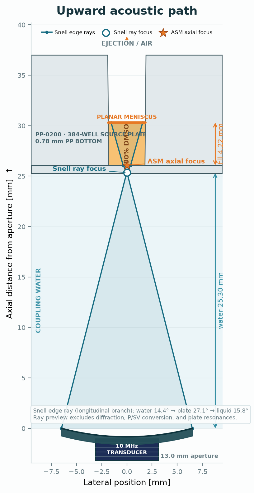
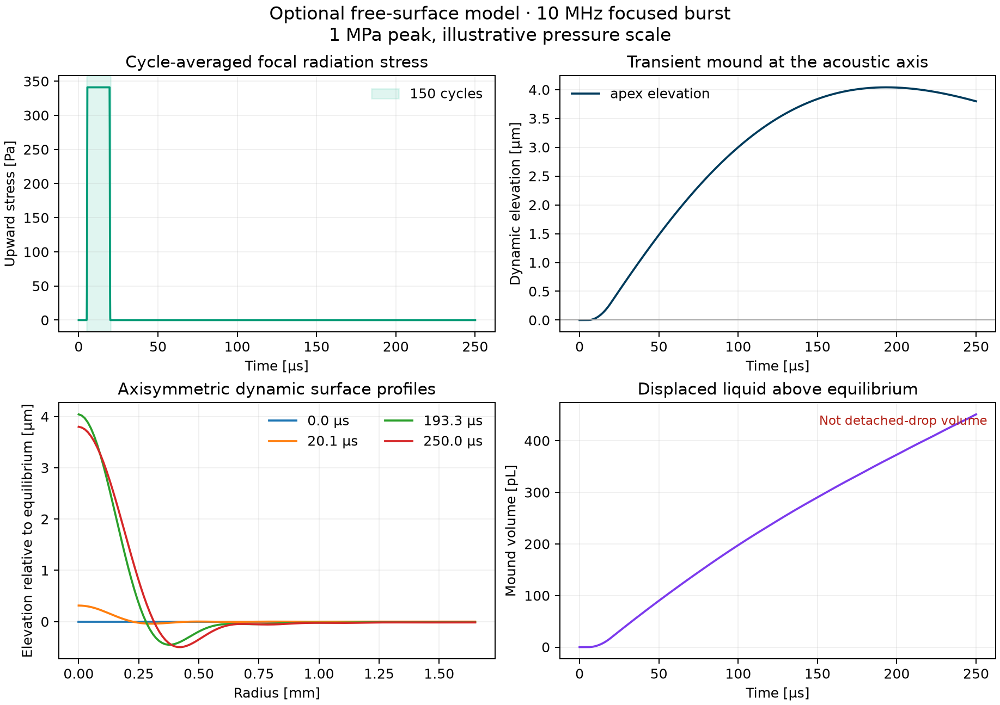
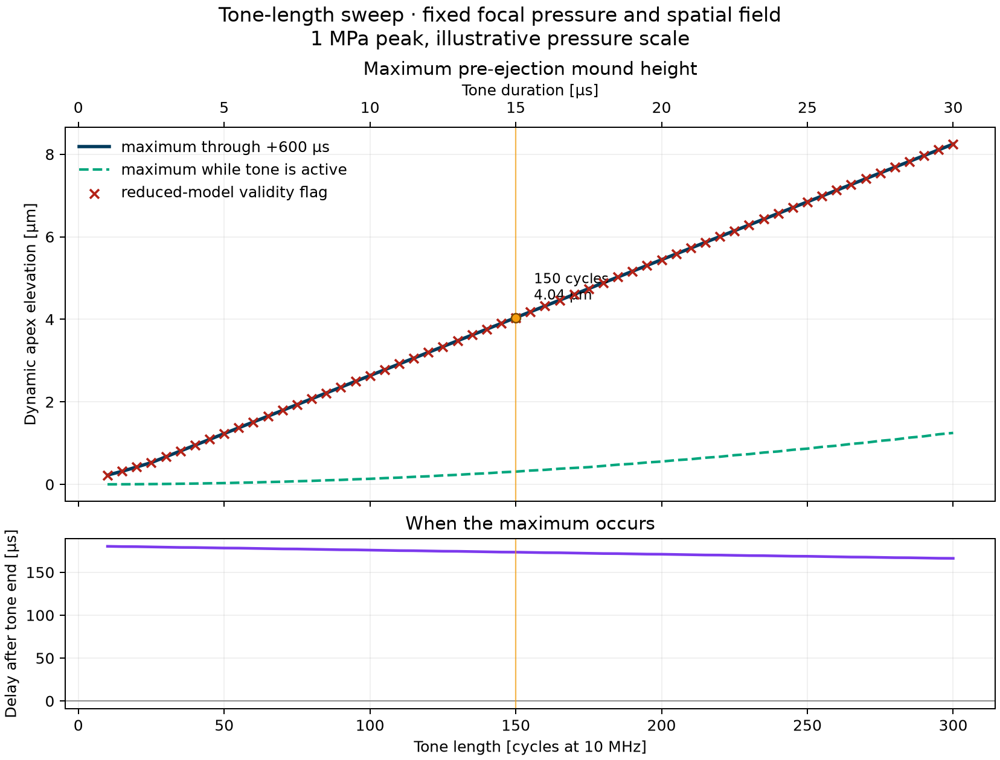
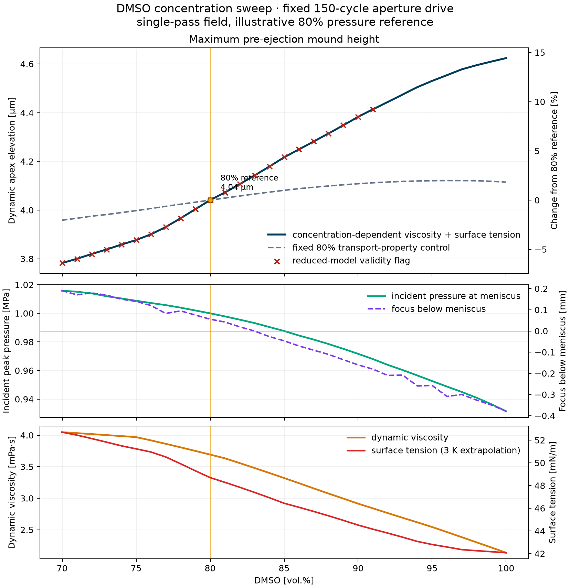

# Angular-Spectrum Model for a Fluid-Coupled Elastic Plate

This repository implements linear, three-dimensional, frequency-domain
angular-spectrum propagation through homogeneous fluid layers and a laterally
infinite, plane-parallel, homogeneous isotropic elastic plate. The baseline
case represents a focused 10 MHz field transmitted from water through a
0.78 mm polypropylene well bottom into a DMSO/water mixture. Optional modules
reconstruct broadband pulse-echo signals, represent a lumped electro-acoustic
chain, compare normalized survey waveforms, and estimate a small-deformation
free-surface response.

The representative baseline configuration is:

| Parameter | Baseline value |
|---|---:|
| Nominal center frequency | 10 MHz |
| Circular-aperture diameter | 13 mm |
| Geometric focal distance | 25.40 mm |
| Temperature | 22 °C |
| Layer sequence | Water → polypropylene → DMSO/water mixture |
| Polypropylene plate thickness | 0.78 mm |
| Measured PP longitudinal-wave speed | 2732 m/s |

The continuous homogeneous-fluid propagation operator does not invoke the
paraxial Fresnel approximation. It uses the Helmholtz dispersion relation

\[
k_z = \sqrt{k^2-k_x^2-k_y^2}
\]

with the outgoing or evanescent-decaying square-root branch. Its numerical
implementation acts on retained components of a finite, sampled, band-limited
FFT grid. Plate scattering is obtained from the coupled boundary-value problem
at both interfaces. Forward and backward P and SV partial waves are included,
representing mode conversion, angle- and frequency-dependent transmission,
and internal plate reverberation. The default radial interpolation of the
plate response, spatial and temporal discretization, material-property
uncertainty, and the assumptions listed below all require convergence or
sensitivity checks.

Governing equations, numerical checks, assumptions, limitations, and an
experimental measurement roadmap are documented in
[**PHYSICS_AUDIT.md**](PHYSICS_AUDIT.md).

The angular-spectrum formulation follows the approach for
layered media ([Vecchio et al., 1994](https://pubmed.ncbi.nlm.nih.gov/7810021/))
and the potential method for fluid-coupled elastic plates
([Almeida et al., 2023](https://arxiv.org/abs/2302.08826)). The effect of a
finite angular spectrum on plate resonances has been documented experimentally
and numerically ([Aanes et al., 2016](https://arxiv.org/abs/1604.02258)). A
related open ASM implementation for a piston transducer is available in
[Sæther, 2023](https://doi.org/10.1016/j.mex.2023.102037).

## Representative outputs

| Normalized broadband pulse-echo response | Phase-optimized CW meniscus response (2–3 mm) |
|:---:|:---:|
| [](results/pulse_echo_80pct_dmso.png) | [](results/meniscus_intensity_sweep.png) |
| **Predicted focal position versus DMSO concentration** | **Normal-incidence PP-plate transmission versus frequency** |
| [](results/dmso_concentration_focus.png) | [](results/transmission_vs_frequency.png) |

Each figure links to a full-resolution PNG. Bundled acoustic fields are
normalized to a prescribed 1 Pa pressure at the equivalent planar aperture.
Absolute pressure and intensity require calibrated complex transmit
sensitivity and electrical loading. Receive voltage and ADC counts additionally
require receive sensitivity, receiver-chain response and termination, and ADC
scaling.

The optional electro-acoustic example includes a provisional
[150 V open-circuit source and tone-length sweep](results/electroacoustic_voltage_tone_sweep.png).
Under its placeholder 50 Ω source and 50 Ω transducer impedances, the modeled
connector voltage is 75 V peak. This example does not provide an absolute
acoustic-amplitude prediction.

## Quick start

```bash
python3 -m venv .venv
source .venv/bin/activate
python -m pip install -e .
asm-pp-case
```

## Interactive analysis interface

`streamlit_app.py` provides an interactive interface for layered geometry,
broadband pulse-echo timing, and focal-field analysis:

[**Open Pulse Echo Focus Lab in your browser**](https://angular-spectrum-model.streamlit.app/)

[](results/streamlit_acoustic_stack.png)

The geometric cross-section is displayed before numerical execution. Blue
aperture-edge rays follow Snell refraction through water, the longitudinal
plate branch, and the liquid; they provide a geometric reference and are not a
pressure-field map. After simulation, an orange marker identifies the on-axis
intensity maximum of the angular-spectrum solution. Its displacement from the
ray estimate reflects diffraction, aperture weighting, elastic P/SV
conversion, and plate resonance effects. The right-hand dimension rail reports
the specified water path, plate-floor thickness, DMSO concentration, liquid
height, and geometry-derived volume.

- Broadband pulse-echo response with water–PP, PP–DMSO, and DMSO–air echoes
- Pulse-response time window automatically framed around all three interface
  reflections while retaining excitation start as the absolute time origin
- Qualitative overlay of an optional uploaded survey JSON file
- Labcyte plate dropdown with `PP-0200` (0.78 mm polypropylene) as the default
- Filling input as either liquid height in millimetres or per-well volume in
  microlitres, with both values shown throughout the interface
- Immediate 2D preview of the upward-facing transducer, plate well, planar
  meniscus, refracted edge rays, and their estimated focus; the local plate
  cutaway repeats pitch-accurate neighbouring wells across the transducer and
  uses crop marks to show that the physical plate continues beyond the view
- Separate post-simulation ASM focus marker and numeric shift relative to the
  Snell-ray estimate
- Current focal position and a search for the water gap that maximizes
  the monochromatic on-axis pressure-squared focus metric at the meniscus
- Separate reflection-exposure estimate at the meniscus: a single-frequency
  separated-pass proxy and a phase-sensitive coherent CW limit, both relative
  to the first forward pass and explicitly not broadband pulse energy

The bundled selector is an offline snapshot of the resolved
[UK Robotics labware catalogue](https://labware.ukrobotics.app/SBSPlatesFlat.json)
and retains direct links to each source record. Fifteen selected commercial
Labcyte variants are mapped to three distinct physical profiles: PP-0200,
LP-0200, and LP-0400. Duplicate or internally inconsistent catalogue records
are omitted. The catalogue provides nominal bottom/well geometry and a raw
sound-speed field, but not density, Poisson ratio, attenuation, tolerances, or
their frequency/temperature dependence. COC density therefore starts from the
representative 1.02 g/cm³ value in the manufacturer's
[TOPAS COC product brochure](https://topas.com/wp-content/uploads/2023/05/TOPAS_Product-Brochure.pdf),
while the COC Poisson ratio remains an editable modeling assumption. Verify
these values and the physical bottom thickness before quantitative use.

The height–volume conversion integrates an idealized square or diamond frustum
directly from the catalogue well widths and depth. The UK Robotics catalogue's
nominal volume field (65 µL for PP-0200, which is also the
[manufacturer's upper 384PP working-volume limit](https://media.beckman.com/-/media/pdf-assets/brochures/echo-acoustic-liquid-handler-consumables-brochure.pdf))
is reported separately; it does not calibrate the volume at the full geometric
well depth. Check the manufacturer's fluid-class working range for other plate
families. The conversion is not a calibrated liquid-volume measurement. Real
wells can differ because of sidewall and corner details, the meniscus, wetting,
dead volume, and manufacturing tolerances.

Run the interface locally with:

```bash
source .venv/bin/activate
python -m pip install -e ".[app]"
streamlit run streamlit_app.py
```

The application then opens in your browser. Results can be downloaded directly
as PNG, CSV, and JSON files. Uploaded survey data is not written to the
repository or any results directory. ADC traces remain independently
normalized qualitative signals.

The same repository can be deployed publicly with
[Streamlit Community Cloud](https://share.streamlit.io/). After connecting the
GitHub repository, select the desired branch and `streamlit_app.py` as the
entrypoint. Subsequent changes to that branch are automatically reflected in
the web app.

The focus optimization varies the water gap and maximizes the monochromatic
single-pass on-axis pressure-squared proxy at the planar meniscus. It includes
the selected elastic-plate transmission and the DMSO sound speed, while
deliberately keeping cavity interference separate from the focus metric.
Water and DMSO properties both
follow the selected temperature. Invalid grid/path combinations are rejected
instead of silently clipping the required aperture spectrum.

The reflection-exposure card does not claim absolute energy at the free
surface. It sums forward pass powers at the selected centre frequency and
compares them with the first pass. This is a narrow-band separated-pass proxy,
not the spectrally integrated fluence of the finite pulse. It also reports the
single-frequency coherent limit separately, because that value can increase or
decrease with fill height through constructive or destructive interference.
Electrical burst length is compared with the cavity round trip, but acoustic
overlap remains unverified without a causal ring-down calibration. Neither
ratio is net transmission into air or a droplet-ejection efficiency.

The default calculation creates the following files in `results/`:

- `axial_scan.png`: axial pressure with PP and a reference without PP
- `focal_plane.png`: 2D pressure field in the calculated focal plane
- `lateral_profile.png`: lateral −6 dB profile
- `transmission_vs_angle.png`: angle-dependent reflection and transmission
- `transmission_vs_frequency.png`: plate resonances
- `monochromatic_results.npz`: complex fields and curves
- `summary.json`: parameters, focal position, FWHM, and plausibility metrics

A broadband, transducer-bandpass-filtered, three-cycle rectangular excitation
can optionally be reconstructed:

```bash
asm-pp-case --pulse
```

A dedicated sweep is available for a 4.22 mm layer containing 70–100% DMSO.
Volume percent is used by default:

```bash
asm-dmso-sweep --basis volume --dmso-height-mm 4.22
# Or run the directly editable example:
python examples/dmso_concentration_sweep.py
```

The mixture properties are not calculated by linear interpolation between
water and DMSO. They are interpolated from measured density and sound-speed
data at 20 and 40 °C
([Palaiologou et al., 2006](https://doi.org/10.1007/s10953-006-9082-5)).
Pure-water sound speed uses the continuous Marczak correlation
([Marczak, 1997](https://doi.org/10.1121/1.420332)); water density uses the
atmospheric-pressure Kell correlation
([Kell, 1975](https://doi.org/10.1021/je60064a005)).

`DMSOWaterProperties` also provides dynamic viscosity and liquid–air surface
tension. Viscosity uses the measured 20, 30, and 40 °C
isotherms of
[Omota et al. (2008)](https://revroum.lew.ro/wp-content/uploads/2008/RRCh_11_2008/Art%2001.pdf).
Surface tension uses the 112 DMSO/water measurements at 25--55 °C from
[Markarian and Terzyan](https://doi.org/10.1021/je7001013), as distributed in
the [NIST ThermoML record](https://trc.nist.gov/ThermoML/10.1021/je7001013.html),
with the missing pure-water endpoint supplied by
[IAPWS R1-76(2014)](https://www.iapws.org/relguide/Surf-H2O.html).
At the default 22 °C, mixture surface tension is a continuity-preserving 3 K
extrapolation below the measured range and the returned
`surface_tension_temperature_extrapolated` flag is `True`.

| DMSO [vol.%] at 22 °C | Dynamic viscosity [mPa·s] | Surface tension [mN/m] |
|---:|---:|---:|
| 70 | 4.048 | 52.700 |
| 80 | 3.693 | 48.699 |
| 90 | 2.914 | 44.512 |
| 100 | 2.135 | 42.077 |

Volume percentages are converted using the neat-component volumes before
mixing. If a laboratory concentration is defined against the final contracted
solution volume, the conversion remains an approximation and should be
replaced by a measured composition.

A monostatic pulse-echo example uses the same focused transducer first as the
transmitter and then as the receiver. It simulates a positive-going
single-cycle 10 MHz pulse through 25.3 mm of water, 0.78 mm of PP, and 4.22 mm
of 80 vol.% DMSO to the air interface:

```bash
python examples/pulse_echo_80pct_dmso.py
```

The transducer response uses the certificate-reported specifications of the
Doppler-I2-10P13F25-H probe: a 25.40 mm focus, 9.97 MHz center frequency,
11.29 MHz peak frequency, and 108.22% relative −6 dB pulse-echo bandwidth.
Because this is a two-way pulse-echo response, it is applied once rather than
factorized into separate transmit and receive responses.

The ping time axis uses the excitation start as $t=0$. The plot marks the
water–PP, PP–DMSO, and first retained DMSO–air return separately. The
frequency-dependent PP plate response continues to include its internal
multiple reflections. Later liquid-cavity returns require a wider grid/record
and a convergence check. All received signals remain normalized unless the
electrical and acoustic paths have been calibrated.

## Optional electro-acoustic source and burst-duration model

An optional electro-acoustic layer connects an open-circuit source-voltage
waveform to the existing acoustic solver without changing its normalized
defaults. It provides:

- A Thevenin source with constant or frequency-dependent source impedance
- Constant, measured, or fitted complex transducer impedance
- A four-element Butterworth–Van Dyke impedance model
- Separate complex transmit sensitivity in Pa/V and receive sensitivity in V/Pa
- Receiver gain/filter response and optional ADC counts/V conversion
- Optional explicit receiver input impedance and receive-side loading
- Terminal voltage, current, delivered energy, aperture pressure, received
  voltage, and ADC waveform

For each frequency bin, the connector voltage is calculated as

\[
V_T(f)=V_S(f)\frac{Z_T(f)}{Z_S(f)+Z_T(f)}.
\]

With supplied electro-acoustic calibration functions, the modeled receiver
voltage is

\[
V_R(f)=V_T(f)H_{TX}(f)H_{acoustic}(f)H_{RX}(f)H_{receiver}(f).
\]

Burst length is therefore evaluated from the supplied waveform and modeled
response; it is not approximated by multiplying a one-cycle peak.

Run the voltage and tone-length sweep with:

```bash
python examples/electroacoustic_voltage_tone_sweep.py
```

The example uses the certificate-reported pulse-echo bandwidth as a zero-phase
spectral shape, split equally between transmit and receive. Its default 50 Ω probe
impedance and unit Pa/V and V/Pa sensitivities are placeholders, so every plot
is labelled **provisional**. The `--absolute-calibration` flag records a
user-declared calibration state; traceable absolute interpretation also
requires documented calibration provenance, reference plane, date, and
uncertainty.

The source voltage argument is explicitly an **open-circuit Thevenin peak
voltage**. It is not automatically the loaded probe voltage or the pulser's
front-panel setting. The reported energy is net electrical energy absorbed by
the modeled load over the record, not acoustic energy delivered to the liquid.
The sweep reports the first gated DMSO–air echo separately from the global
composite receiver peak. Both are receiver metrics; neither is a direct
meniscus-force or ejection-efficiency metric.

The lower-level API is available independently of the web application:

```python
from angular_spectrum import (
    ButterworthVanDyke,
    ElectroAcousticCalibration,
    simulate_electroacoustic_pulse_echo,
)

bvd = ButterworthVanDyke(
    static_capacitance_f=100e-12,
    motional_resistance_ohm=20.0,
    motional_inductance_h=250e-9,
    motional_capacitance_f=10e-12,
)
calibration = ElectroAcousticCalibration(
    transmit_pressure_pa_per_v=measured_tx_response,
    receive_voltage_v_per_pa=measured_rx_response,
    receiver_response=measured_receiver_response,
    adc_counts_per_v=measured_adc_counts_per_v,
    absolute=True,
)
result = simulate_electroacoustic_pulse_echo(
    model,
    time_s,
    open_circuit_source_voltage_v,
    source_impedance_ohm=50.0,
    transducer_impedance_ohm=bvd.impedance,
    calibration=calibration,
    fluid_layer_thickness_m=4.22e-3,
    backing_fluid=air,
)
```

The Streamlit application uses the normalized certificate-based response by
default. The optional electrical model is not activated by the existing web
inputs; consequently, the published interface does not imply an absolute
electrical or acoustic calibration.

Concentration, fill height, and temperature can be changed for comparison:

```bash
python examples/pulse_echo_80pct_dmso.py \
  --dmso-percent 73 \
  --dmso-height-mm 4.22 \
  --temperature-c 22
```

A survey JSON file can be overlaid exclusively as an independently normalized
timing and pulse-shape reference:

```bash
python examples/pulse_echo_80pct_dmso.py \
  --dmso-percent 73 \
  --survey-json /path/to/survey.json
```

ADC values are not interpreted as pressure or intensity. `FluidMaterial`,
temperature, and a fill height calculated only from time of flight are not
used to calibrate the material properties. The raw file is neither copied nor
embedded in the result files.

When a survey is loaded, the web interface can optionally derive a bounded,
regularized complex response from the measured water–PP echo. This in-situ
reference represents the common pulser, transducer, receiver, and ADC waveform
response and is applied equally to every displayed simulated echo. It does not
change geometry or focus, and it does not convert ADC counts into pressure.

The recommended geometry mode is **Survey TOF · keep manual water gap**. It
preserves an independently measured probe-to-PP distance such as 25.3 mm while
deriving PP thickness and fluid height only from differences between the three
echo markers. **Survey metadata · all distances** is available for diagnostics,
but it also adopts the stored TOF-derived water distance.

Directly below the JSON upload, the web interface shows **Survey → inputs**
before it changes any field. **Apply stored survey values to inputs** copies
the recognized plate, all available distance fields already present in the
JSON (`ProbeToPlateBaseDistance`, `WellBaseThickness`, and `FluidHeight`), plus
the recorded excitation frequency and tone length. It does not reinterpret
those stored distances using the selected DMSO concentration or temperature.
They can already be firmware-derived TOF values with an assumed sound speed,
so the preview identifies their source explicitly.

The second action, **Calculate all distances from timestamps**, ignores every
stored distance and overwrites the complete geometry from the three echo
markers:

- water gap = `water sound speed × water–PP time / 2`;
- plate bottom = `plate sound speed × (PP–liquid − water–PP time) / 2`;
- filling = `fluid sound speed × (liquid–air − PP–liquid time) / 2`.

It uses the selected DMSO concentration, temperature, and plate sound speed,
keeps the transducer settings unchanged, and returns the geometry source to
**Manual geometry** so every calculated value remains visible and editable.
The absolute water timestamp can contain trigger/electronics, acoustic
phase-center, and group-delay offsets, so this water gap is explicitly labeled
approximate. Timestamp differences cancel a common fixed delay but remain
sensitive to interface picking and reflection phase. Neither survey button
runs the simulation or treats ADC amplitude as calibrated pressure.

The two-panel pulse-response chart is interactive. Its RF and envelope time
axes zoom and pan together while retaining independent amplitude axes. Drag or
pinch to zoom, choose the hand tool to pan, and use **Reset axes** to restore
the initial window around all three interface reflections. The PNG download
is a static rendering of the same traces.

A separate comparison tool provides a detailed analysis of JSON timestamps,
locally normalized echo shapes, and spectra:

```bash
python examples/survey_json_comparison.py /path/to/survey.json \
  --dmso-percent 73 \
  --temperature-c 22 \
  --known-water-path-mm 25.3
```

The detailed comparison enables the same water–PP reference correction by
default and reports waveform correlations before and after correction. Use
`--no-reference-calibration` to inspect the uncorrected certificate-based
simulation. Raw and corrected traces are both retained in the private NPZ
output.

Measured material losses can be supplied without changing the reference
calibration:

```bash
python examples/survey_json_comparison.py /path/to/survey.json \
  --dmso-percent 73 \
  --known-water-path-mm 25.3 \
  --pp-alpha-l-db-m 2500 \
  --pp-alpha-s-db-m 4000 \
  --fluid-alpha-db-m 150 \
  --attenuation-power 1.0
```

These values are amplitude losses in dB/m at 10 MHz. They remain explicit user
inputs and are never silently fitted from uncertain survey metadata.

The script reports both the stored distances and the time-of-flight-equivalent
distances calculated from the echo spacing for the selected fluid. This makes
it apparent when the JSON distances were originally calculated with a fixed
assumed sound speed. The three echo shapes are shifted in time and normalized
independently before comparison. Correlation, residual time shift, local
spectrum, and relative envelope peaks are therefore qualitative diagnostic
metrics, not an absolute pressure calibration. Plots derived from raw data are
stored under `results/private/` and ignored by Git.

### Probe-position sweep comparison

A directory containing a `tof_z_offset_summary.json` plus one survey JSON per
probe position can be evaluated as one coherent focus scan:

```bash
python examples/tof_z_offset_comparison.py tof_z_offset_results \
  --dmso-percent 80 \
  --temperature-c 22
```

The batch analysis preserves one relative ADC scale across all positions,
checks that frequency, tone length, voltage setting, plate, well, and sampling
remain constant, and uses one common PP thickness and liquid round-trip delay.
It runs the monostatic broadband pulse-echo model at every z position.
One bounded waveform correction is estimated from the z=0 water–PP echo and
then applied unchanged to every simulated trace, preserving their modeled
relative variation over z. The nominal scan geometry is
`base water path - z offset`; by default `focal_distance_mm` in the sweep
summary is treated as the z=0 base path and should be checked against the
actual stage datum. Pass `--base-water-path-mm` when an independent gap is
available. Stored survey distances are not used as independent geometry
because they are calculated from absolute echo timing and an assumed sound
speed. The reported optimum z offset shifts one-for-one with this base-gap
input, so datum uncertainty must not be confused with focus-model precision.

The generated timing, response, and waveform plot plus CSV and JSON metrics are
written under `results/private/tof_z_offset/`. The plots distinguish the
survey detector's positive amplitude estimates, modeled monostatic pulse
returns, and the on-axis single-pass intensity focus proxy. Fluid identity and
temperature remain hypotheses, and ADC amplitudes remain qualitative. In the
current dataset, the small set of separately normalized points does not cross
the meniscus maximum, so it cannot validate concentration, absolute gain, or
the focal position. The raw
`tof_z_offset_results/` directory is ignored by Git because it can contain
device addresses, timestamps, encoder positions, and full ADC records.

For an ideal phase-conjugate aperture optimized independently at every height,
the CW forward intensity directly below the DMSO–air interface can be evaluated
over a fill-height range from 2 to 3 mm:

```bash
python examples/meniscus_intensity_sweep.py
```

The example compares an adaptively converged, order-specific coherent cavity
sum with a one-way reference that excludes DMSO cavity reflections. It also
stores total fluid-side pressure, velocity, and displacement. The displacement
is the first-order 10 MHz oscillatory displacement—not slow mound height or jet
deformation. The phase is independently optimized for on-axis pressure at
each height; this is not a strict intensity optimum or a fixed-focus
single-element scan. Its steady-state interference
fringes do not describe the first surface response of a one-cycle pulse; at the
default 4.22 mm height, the first cavity return arrives about 51.7 cycles later.

## Acoustic droplet-ejection screening

Print diffraction and cavity-delay scales for the current geometry with:

```bash
python examples/ade_design_screen.py
```

For the default 80 vol.% DMSO case it reports a 0.325 mm homogeneous-medium
one-way intensity-FWHM proxy and a 5.172 µs liquid-cavity round trip. The
layered model gives about 0.303 mm at the nominal optimum. The corresponding
18 nL
spot-equivalent sphere is a geometric scale, **not a predicted droplet volume**.
Ejection threshold, volume, velocity, satellites, cavitation, and heating need
absolute calibration and free-surface measurements. Follow the staged workflow
in [PHYSICS_AUDIT.md](PHYSICS_AUDIT.md) before extrapolating from voltage.

## Optional transient free-surface response

The library includes a separate, opt-in axisymmetric model for the
**small-deformation mound and capillary-wave response**. It is not called or
exposed by the Streamlit application and does not change any existing
simulation or default.
The hydrodynamic input is a slowly varying upward normal radiation stress—not
the raw 10 MHz carrier and not the nearly zero total acoustic pressure at a
liquid–air pressure-release boundary.

The model includes:

- nonlinear static Young–Laplace equilibrium with gravity, volume conservation,
  surface tension, and a measured equilibrium contact angle;
- fixed-contact-angle perturbations in a circular well; a pinned contact line
  is not supported until its coupled rigid-wall fluid constraint is implemented;
- finite-depth axisymmetric capillary–gravity modes;
- dynamic viscosity through the weak-viscosity modal decay rate;
- transient average-acceleration Newmark integration;
- surface elevation, velocity, curvature, displaced mound volume, mechanical
  energy, acoustic work, and explicit validity flags.

For an ideal reflecting free surface, a calibrated incident peak-pressure
envelope is converted to radiation stress with

\[
q(r,t)=\frac{|p_\mathrm{inc}(r,t)|^2}{\rho c^2}.
\]

Run the 150-cycle example with:

```bash
python examples/free_surface_150_cycle_mound.py
```

[](results/free_surface_150_cycle_mound.png)

Sweep the tone length at fixed focal pressure with:

```bash
python examples/free_surface_tone_length_sweep.py
```

[](results/free_surface_tone_length_sweep.png)

The default sweep covers 10–300 cycles and searches for the maximum apex
elevation through an equal 600 µs interval after every burst. At the
illustrative 1 MPa pressure scale, the 150-cycle case reaches approximately
4.04 µm above the equilibrium meniscus, about 173 µs after the tone ends.
The measured-property baseline has 3.69 mPa·s viscosity and all tone-length
cases are therefore marked because at least one materially participating mode
exceeds the solver's weak-viscosity damping-ratio limit. The 300-cycle case
also reaches the moving-surface acoustic-feedback flag.
The nearly linear trend is not an ejection optimum: transducer ring-up and
finite liquid-cavity build-up are deliberately absent from this sweep.

At a fixed 150-cycle tone length, sweep 70–100 vol.% DMSO with:

```bash
python examples/free_surface_dmso_concentration_sweep.py
```

[](results/free_surface_dmso_concentration_sweep.png)

This comparison uses one common aperture-pressure scale, chosen so the 80%
case has an illustrative 1 MPa incident pressure on axis at the meniscus.
Every concentration therefore retains its own PP transmission, refracted
focus, focal spot, density, sound speed, viscosity, surface tension, and
radiation stress. It is not renormalized independently. The plot also contains
a control calculation with viscosity and surface tension held at their 80%
values, isolating the incremental transport-property contribution.

In this single-pass baseline, the concentration-dependent curve rises from
about 3.78 µm at 70% through 4.04 µm at 80% to 4.62 µm at 100%; the virtual
focus crosses the 4.22 mm meniscus near 83%. Relative to the fixed-transport
control, viscosity and surface tension change the result by about -4.4% at
70% and +12.4% at 100%. Cases through 91% trigger the weak-viscosity validity
flag, so these values are sensitivity estimates rather than quantitatively
validated predictions. Surface tension at 22 °C is additionally the flagged 3 K
extrapolation described above.

Wetting angle and liquid attenuation remain fixed across concentration. This
is especially important because a 150-cycle burst contains approximately
three liquid-cavity round trips, while the current forcing omits their
coherent build-up.

The default 1 MPa incident pressure and contact angle are explicitly
illustrative. The radial load shape comes from the
existing single-pass angular-spectrum field at the meniscus and is scaled to
that supplied peak pressure; finite cavity build-up is not yet included in
this example. After a traceable field calibration, use for example:

```bash
python examples/free_surface_150_cycle_mound.py \
  --incident-pressure-mpa 1.35 \
  --absolute-calibration
```

Compare viscosity, surface tension, and static wetting-angle assumptions with:

```bash
python examples/free_surface_wetting_viscosity_sweep.py
```

All four examples write PNG, CSV, and JSON results; the full 150-cycle field
is also stored as a compressed NumPy archive. The quantity
`positive_mound_volume_m3` denotes liquid displaced above the equilibrium
plane and must not be interpreted as droplet volume. The surface remains a
single-valued graph, so overturning, jet formation, pinch-off, satellites, and
spray are outside the model. Those require a validated moving-boundary
two-phase Navier–Stokes or equivalent solver. The formulation uses the
weak-viscosity, small-deformation limit motivated by the experiments and
analysis of
[Issenmann et al.](https://doi.org/10.1017/jfm.2011.236) and the ADE mound
measurements of [Cinbis et al.](https://doi.org/10.1121/1.407456); it must not
be extrapolated into the breakup regimes observed by
[Tomita et al.](https://doi.org/10.1063/1.4895902).

The nonlinear static wetting profile is retained in the reported geometry,
but the transient modal dispersion is linearized about a flat surface. A
validity flag is raised when the static or dynamic slope becomes too large,
when the weak-viscosity approximation fails, or when the deformation is large
enough that frozen acoustic-cavity feedback is doubtful.

## Parameters requiring experimental characterization

Of the polypropylene elastic properties, only the longitudinal-wave speed is
currently constrained by measurement. Consequently, the following defaults
are model inputs and not calibration results:

- PP density: 900 kg/m³
- PP Poisson ratio: 0.42, corresponding to \(c_S \approx 1015\) m/s
- PP attenuation for P and SV waves: 0 dB/m by default
- Pure DMSO at 22 °C: 1495.74 m/s and 1098.337 kg/m³ from interpolation of
  the same 20–40 °C literature table used for mixtures
- Pure water at 22 °C: 1488.358 m/s from Marczak and 997.800 kg/m³ from Kell
- Water path to the PP front: 20 mm in the monochromatic CLI/sweep examples;
  25.3 mm in the pulse-echo and Streamlit defaults

In addition to traceable electro-acoustic field calibration, quantitative
transmission and pressure estimates require the PP density, PP shear-wave
speed, longitudinal and transverse attenuation, and the sound speed and
density of the actual DMSO mixture. Custom measured values can be provided as
follows:

```bash
asm-pp-case \
  --water-path-mm 20.0 \
  --pp-density 905 \
  --pp-shear-speed 1080 \
  --pp-alpha-l-db-m 2500 \
  --pp-alpha-s-db-m 4000 \
  --dmso-speed 1497 \
  --dmso-density 1097
```

The attenuation values describe amplitude loss in dB/m at the simulated center
frequency. Resonance frequencies depend on plate thickness and elastic
properties, while attenuation strongly affects linewidth and amplitude;
quantitative use therefore requires uncertainty estimates for all of these
inputs.

## Python API

```python
import numpy as np

from angular_spectrum import (
    AngularSpectrumModel,
    CartesianGrid,
    ElasticPlate,
    ElasticSolid,
    Fluid,
    FocusedCircularAperture,
    dmso_water_properties,
    water_properties,
)

water_data = water_properties(22.0)
water = Fluid(
    "water_22C",
    water_data.density_kg_m3,
    water_data.sound_speed_m_s,
)
dmso_data = dmso_water_properties(
    1.0,
    basis="volume",
    temperature_c=22.0,
)
# Hydrodynamic inputs are available from the same composition conversion.
print(dmso_data.dynamic_viscosity_pa_s)
print(dmso_data.surface_tension_n_m)
print(dmso_data.surface_tension_temperature_extrapolated)
dmso = Fluid(
    "DMSO_22C",
    dmso_data.density_kg_m3,
    dmso_data.sound_speed_m_s,
)
pp = ElasticSolid.from_longitudinal_speed_and_poisson(
    name="PP",
    density_kg_m3=900.0,
    longitudinal_speed_m_s=2732.0,  # measured
    poisson_ratio=0.42,              # replace once cS has been measured
)

model = AngularSpectrumModel(
    grid=CartesianGrid(nx=512, ny=512, dx_m=40e-6),
    aperture=FocusedCircularAperture(13e-3, 25.4e-3),
    incident_fluid=water,
    plate=ElasticPlate(pp, 0.78e-3),
    transmitted_fluid=dmso,
    water_path_m=20e-3,
)

z_after_pp = np.linspace(0.0, 10e-3, 161)
axis_pressure = model.on_axis_scan_after_plate(10e6, z_after_pp)
focus_index = np.argmax(np.abs(axis_pressure))
focus_z = 20e-3 + 0.78e-3 + z_after_pp[focus_index]
focal_plane = model.field_after_plate(10e6, z_after_pp[focus_index])
print(f"Focus at {focus_z * 1e3:.3f} mm")
```

A fully editable example is available at
[`examples/custom_case.py`](examples/custom_case.py).

## Physical scope and limitations

Included:

- Nonparaxial angular-spectrum propagation using the homogeneous-fluid
  dispersion relation on a finite, sampled FFT grid
- Retained propagating and evanescent components using the outgoing/decaying
  root
- P/SV mode conversion in a laterally infinite, plane-parallel, homogeneous
  isotropic elastic plate
- Internal reflections and resonances of the idealized infinite plate
- Frequency- and angle-dependent complex transmission
- Lossy media represented by complex wavenumbers
- Optional band-limited ASM evaluation to reduce numerical wrap-around
- Cumulative layered-path band limits based on total transverse walkoff
- Order-specific liquid-cavity propagation masks (`2h`, `4h`, `6h`, ...)
- A finite-order liquid-surface echo series truncated before FFT-record
  wraparound
- Optional time-domain reconstruction of a broadband pulse
- Optional Thevenin/BVD terminal model and calibration-capable Pa/V-to-V/Pa
  pulse-echo wrapper
- Optional one-way, linearized axisymmetric small-deformation surface response
  with nonlinear static wetting equilibrium, viscosity, gravity, and surface
  tension

Not included:

- Nonplanar acoustic interfaces or a dynamically deforming meniscus in the
  acoustic propagation model
- Spatially varying fluid properties, well-wall scattering, or acoustic
  feedback from the evolving free surface
- Elastic anisotropy of oriented or extruded PP film
- Finite lateral dimensions or tilt of the PP plate
- Surface roughness, adhesive layers, air bubbles, or additional layers
- Nonlinearity at high acoustic pressures
- Large or overturning meniscus deformation, acoustic streaming, capillary
  jets, pinch-off, detached droplets, satellites, cavitation, and thermal
  accumulation
- A probe-specific KLM or Mason stack derived from piezoelectric, matching-layer,
  backing, lens, and housing material constants
- Causal broadband dispersion associated with attenuation; the current
  power-law attenuation is a narrowband phenomenological model
- A measured causal phase/ring-down model for the probe and electronics. The
  certificate-only zero-phase magnitude and hard active-bin threshold can
  create small symmetric pre-ringing; do not interpret it as a physical echo.

Pulse calculations should be repeated with a longer time record, a lower
spectral threshold, and measured PP/fluid loss. The retained liquid-surface
echo count uses central-ray delays plus an explicit response guard; oblique
rays and plate-modal group delays can arrive later. The elastic plate itself is
a steady-state frequency-domain scattering solution, so a lossless plate can
retain long internal reverberation. Time-domain causality therefore requires
record-length convergence and, ultimately, measured complex system phase and
loss—not just a larger nominal echo count.

The source is a planar equivalent circular aperture with a phase profile
corresponding to an ideal spherical focus. Bundled fields are normalized to a
prescribed 1 Pa pressure at that equivalent aperture and support comparisons of
focus, field shape, timing, and transfer response. Absolute pressure and
intensity require calibrated complex transmit sensitivity and electrical
loading. Receive voltage and ADC counts additionally require receive
sensitivity, receiver-chain response and termination, and ADC scaling.

## Numerical verification

```bash
python -m pytest
```

The tests cover, in particular:

- The outgoing/decaying \(k_z\) root
- Agreement with the analytical layer formula at normal incidence
- Energy conservation \(R+T=1\) for a lossless plate
- Asymmetric-fluid reciprocity, grazing limits, and passive material inputs
- Focus and finite fields on a reduced grid
- The time convention used for pulse reconstruction
- Temperature-consistent water timing, two-way propagation masks, explicit
  receive loading, meniscus pressure scaling, and ADE screening scales
- Young–Laplace wetting equilibrium, radial capillary eigenfrequency,
  radiation-stress pressure-squared scaling, viscous modal decay, explicit
  pinned-mode rejection, and free-surface volume conservation
