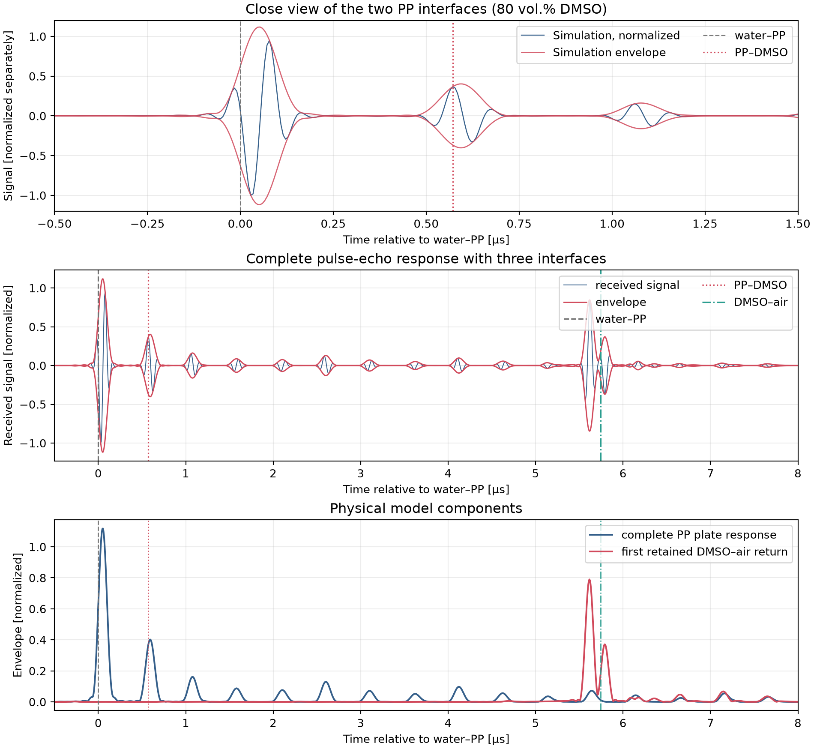
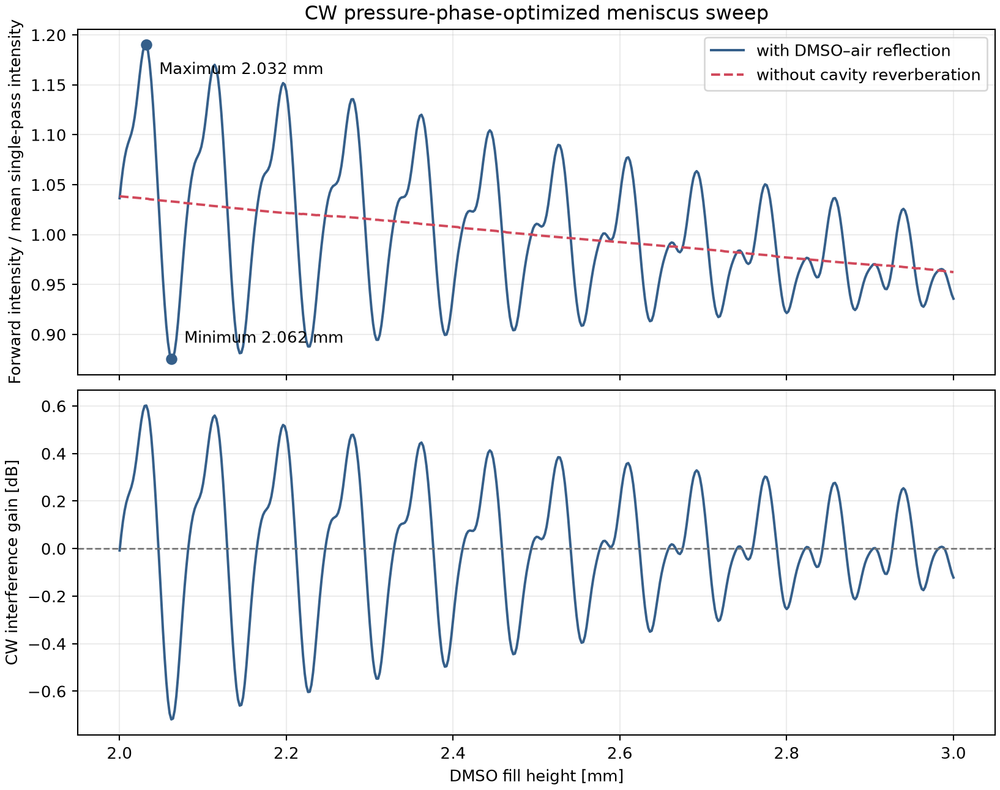
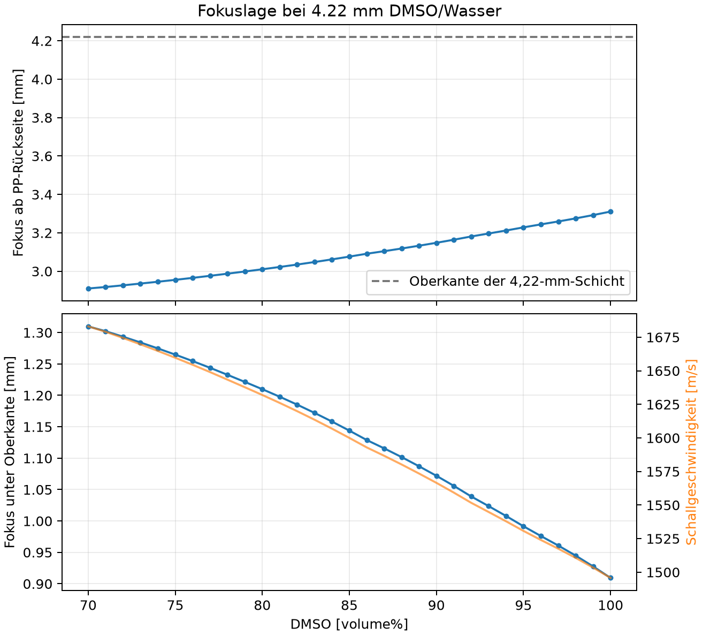
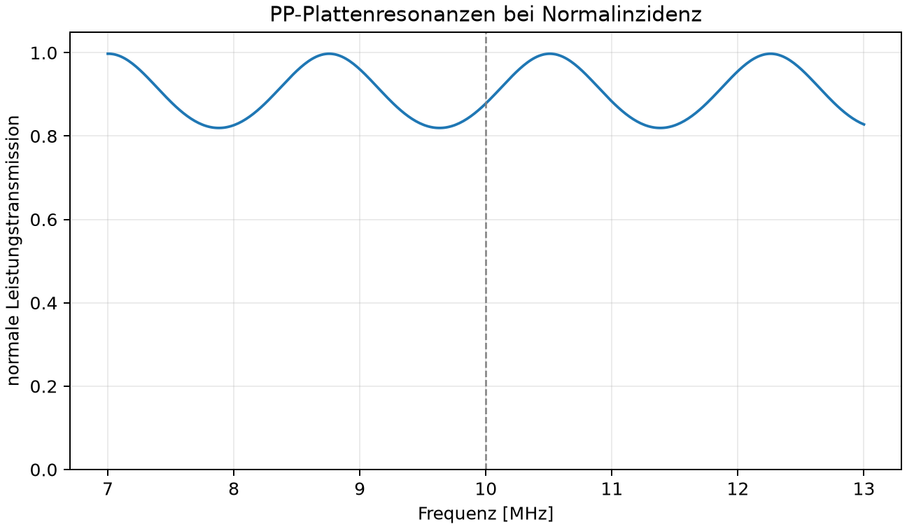

# Fluid–Elastic-Solid–Fluid Angular Spectrum Model

A local Python implementation of the setup described in the shared chat:

| Parameter | Example value |
|---|---:|
| Center frequency | 10 MHz |
| Transducer aperture | 13 mm |
| Geometric focus | 25 mm |
| Temperature | 22 °C |
| Layers | Water → PP → DMSO |
| PP thickness | 0.78 mm |
| Measured longitudinal sound speed in PP | **2732 m/s** |

This is not a paraxial Fresnel model. It propagates every FFT component using

\[
k_z = \sqrt{k^2-k_x^2-k_y^2}
\]

and solves a complete fluid–solid–fluid boundary-value problem at the PP plate
for every transverse wavenumber. Forward- and backward-propagating
longitudinal and SV waves are included in the isotropic PP layer. The model
therefore captures mode conversion, angle-dependent transmission, and all
multiple reflections inside the plate.

The implementation follows the established angular spectrum approach for
layered media ([Vecchio et al., 1994](https://pubmed.ncbi.nlm.nih.gov/7810021/))
and the potential method for fluid-coupled elastic plates
([Almeida et al., 2023](https://arxiv.org/abs/2302.08826)). The effect of a
finite angular spectrum on plate resonances has been documented experimentally
and numerically ([Aanes et al., 2016](https://arxiv.org/abs/1604.02258)). A
related open ASM implementation for a piston transducer is available in
[Sæther, 2023](https://doi.org/10.1016/j.mex.2023.102037).

## Example results

| Broadband pulse-echo response | Meniscus sweep from 2 to 3 mm |
|:---:|:---:|
| [](results/pulse_echo_80pct_dmso.png) | [](results/meniscus_intensity_sweep.png) |
| **DMSO concentration and focal position** | **Frequency-dependent PP transmission** |
| [](results/dmso_concentration_focus.png) | [](results/transmission_vs_frequency.png) |

Click any figure to open the full-resolution PNG. Pressure, receive-signal,
and intensity values are relative quantities unless the complete
transducer/ADC chain has been calibrated.

## Quick start

```bash
python3 -m venv .venv
source .venv/bin/activate
python -m pip install -e .
asm-pp-case
```

## Interactive web interface

`streamlit_app.py` exposes the main parameters as input fields and combines
three analyses in one interface:

[**Open Pulse Echo Focus Lab in your browser**](https://angular-spectrum-model.streamlit.app/)

- Broadband pulse-echo response with water–PP, PP–DMSO, and DMSO–air echoes
- Qualitative overlay of an optional uploaded survey JSON file
- Current focal position and a search for the water gap that maximizes
  one-way intensity at the meniscus

Run the interface locally with:

```bash
source .venv/bin/activate
python -m pip install -e ".[app]"
streamlit run streamlit_app.py
```

The application then opens in your browser. Results can be downloaded directly
as PNG, CSV, and JSON files. Uploaded survey data is not written to the
repository or any results directory. ADC traces remain independently
normalized qualitative signals.

The same repository can be deployed publicly with
[Streamlit Community Cloud](https://share.streamlit.io/). After connecting the
GitHub repository, select the desired branch and `streamlit_app.py` as the
entrypoint. Subsequent changes to that branch are automatically reflected in
the web app.

The focus optimization varies the water gap and maximizes the monochromatic
one-way intensity at the planar meniscus. It includes the complex PP
transmission and the DMSO sound speed, while deliberately keeping cavity
interference separate from the focus metric.

The default calculation creates the following files in `results/`:

- `axial_scan.png`: axial pressure with PP and a reference without PP
- `focal_plane.png`: 2D pressure field in the calculated focal plane
- `lateral_profile.png`: lateral −6 dB profile
- `transmission_vs_angle.png`: angle-dependent reflection and transmission
- `transmission_vs_frequency.png`: plate resonances
- `monochromatic_results.npz`: complex fields and curves
- `summary.json`: parameters, focal position, FWHM, and plausibility metrics

A broadband, transducer-bandpass-filtered, three-cycle rectangular excitation
can optionally be reconstructed:

```bash
asm-pp-case --pulse
```

A dedicated sweep is available for a 4.22 mm layer containing 70–100% DMSO.
Volume percent is used by default:

```bash
asm-dmso-sweep --basis volume --dmso-height-mm 4.22
# Or run the directly editable example:
python examples/dmso_concentration_sweep.py
```

The mixture properties are not calculated by linear interpolation between
water and DMSO. They are interpolated from measured density and sound-speed
data at 20 and 40 °C
([Palaiologou et al., 2006](https://doi.org/10.1007/s10953-006-9082-5)).

A monostatic pulse-echo example uses the same focused transducer first as the
transmitter and then as the microphone. It simulates a positive-going
single-cycle 10 MHz pulse through 25.3 mm of water, 0.78 mm of PP, and 4.22 mm
of 80 vol.% DMSO to the air interface:

```bash
python examples/pulse_echo_80pct_dmso.py
```

The transducer response uses the measured specifications of the
Doppler-I2-10P13F25-H probe: a 25.40 mm focus, 9.97 MHz center frequency,
11.29 MHz peak frequency, and 108.22% relative −6 dB pulse-echo bandwidth.
This two-way response is applied once; it is not incorrectly squared as
separate one-way transmit and receive responses.

The plot marks the water–PP, PP–DMSO, and DMSO–air interfaces separately. The
frequency-dependent PP plate response continues to include its internal
multiple reflections. All received signals remain normalized unless the
electrical and acoustic paths have been calibrated.

Concentration, fill height, and temperature can be changed for comparison:

```bash
python examples/pulse_echo_80pct_dmso.py \
  --dmso-percent 73 \
  --dmso-height-mm 4.22 \
  --temperature-c 22
```

A survey JSON file can be overlaid exclusively as an independently normalized
timing and pulse-shape reference:

```bash
python examples/pulse_echo_80pct_dmso.py \
  --dmso-percent 73 \
  --survey-json /path/to/survey.json
```

ADC values are not interpreted as pressure or intensity. `FluidMaterial`,
temperature, and a fill height calculated only from time of flight are not
used to calibrate the material properties. The raw file is neither copied nor
embedded in the result files.

When a survey is loaded, the web interface can optionally derive a bounded,
regularized complex response from the measured water–PP echo. This in-situ
reference represents the common pulser, transducer, receiver, and ADC waveform
response and is applied equally to every displayed simulated echo. It does not
change geometry or focus, and it does not convert ADC counts into pressure.

The recommended geometry mode is **Survey TOF · keep manual water gap**. It
preserves an independently measured probe-to-PP distance such as 25.3 mm while
deriving PP thickness and fluid height only from differences between the three
echo markers. **Survey metadata · all distances** is available for diagnostics,
but it also adopts the stored TOF-derived water distance.

A separate comparison tool provides a detailed analysis of JSON timestamps,
locally normalized echo shapes, and spectra:

```bash
python examples/survey_json_comparison.py /path/to/survey.json \
  --dmso-percent 73 \
  --temperature-c 22 \
  --known-water-path-mm 25.3
```

The detailed comparison enables the same water–PP reference correction by
default and reports waveform correlations before and after correction. Use
`--no-reference-calibration` to inspect the uncorrected certificate-based
simulation. Raw and corrected traces are both retained in the private NPZ
output.

Measured material losses can be supplied without changing the reference
calibration:

```bash
python examples/survey_json_comparison.py /path/to/survey.json \
  --dmso-percent 73 \
  --known-water-path-mm 25.3 \
  --pp-alpha-l-db-m 2500 \
  --pp-alpha-s-db-m 4000 \
  --fluid-alpha-db-m 150 \
  --attenuation-power 1.0
```

These values are amplitude losses in dB/m at 10 MHz. They remain explicit user
inputs and are never silently fitted from uncertain survey metadata.

The script reports both the stored distances and the time-of-flight-equivalent
distances calculated from the echo spacing for the selected fluid. This makes
it apparent when the JSON distances were originally calculated with a fixed
assumed sound speed. The three echo shapes are shifted in time and normalized
independently before comparison. Correlation, residual time shift, local
spectrum, and relative envelope peaks are therefore qualitative diagnostic
metrics, not an absolute pressure calibration. Plots derived from raw data are
stored under `results/private/` and ignored by Git.

For ideal focusing that tracks the meniscus, the forward intensity directly
below the DMSO–air interface can be evaluated over a fill-height range from 2
to 3 mm:

```bash
python examples/meniscus_intensity_sweep.py
```

The example compares the coherent calculation including all reflections with
a one-way reference that excludes DMSO cavity reflections. This keeps the
interference effect distinguishable from the focal shift.

## Important parameters that still require measurement

Only the longitudinal PP sound speed was measured in the shared setup.
Consequently, the following defaults are explicitly **starting values**, not a
calibration:

- PP density: 900 kg/m³
- PP Poisson ratio: 0.42, corresponding to \(c_S \approx 1015\) m/s
- PP attenuation for P and SV waves: 0 dB/m by default
- DMSO at 22 °C: 1499 m/s and 1098.4 kg/m³ as a literature approximation
- Water at 22 °C: 1488.4 m/s and 997.77 kg/m³
- Water path to the front of the PP plate: 20 mm

For reliable absolute pressures, at least the PP density, PP shear-wave speed,
longitudinal and transverse attenuation, and the sound speed and density of
the actual DMSO mixture should be measured. Custom measured values can be
provided as follows:

```bash
asm-pp-case \
  --water-path-mm 20.0 \
  --pp-density 905 \
  --pp-shear-speed 1080 \
  --pp-alpha-l-db-m 2500 \
  --pp-alpha-s-db-m 4000 \
  --dmso-speed 1497 \
  --dmso-density 1097
```

The attenuation values describe amplitude loss in dB/m at the simulated center
frequency. Without measured attenuation, the resonance positions may still be
meaningful, but their heights—and therefore the peak pressure—are not.

## Using the Python library

```python
import numpy as np

from angular_spectrum import (
    AngularSpectrumModel,
    CartesianGrid,
    ElasticPlate,
    ElasticSolid,
    Fluid,
    FocusedCircularAperture,
)

water = Fluid("water_22C", 997.77, 1488.4)
dmso = Fluid("DMSO_22C", 1098.4, 1499.0)
pp = ElasticSolid.from_longitudinal_speed_and_poisson(
    name="PP",
    density_kg_m3=900.0,
    longitudinal_speed_m_s=2732.0,  # measured
    poisson_ratio=0.42,              # replace once cS has been measured
)

model = AngularSpectrumModel(
    grid=CartesianGrid(nx=512, ny=512, dx_m=40e-6),
    aperture=FocusedCircularAperture(13e-3, 25e-3),
    incident_fluid=water,
    plate=ElasticPlate(pp, 0.78e-3),
    transmitted_fluid=dmso,
    water_path_m=20e-3,
)

z_after_pp = np.linspace(0.0, 10e-3, 161)
axis_pressure = model.on_axis_scan_after_plate(10e6, z_after_pp)
focus_index = np.argmax(np.abs(axis_pressure))
focus_z = 20e-3 + 0.78e-3 + z_after_pp[focus_index]
focal_plane = model.field_after_plate(10e6, z_after_pp[focus_index])
print(f"Focus at {focus_z * 1e3:.3f} mm")
```

A fully editable example is available at
[`examples/custom_case.py`](examples/custom_case.py).

## Physical scope and limitations

Included:

- Exact 3D FFT propagation without a paraxial \(k_z\) approximation
- Propagating and evanescent components using the outgoing/decaying root
- P/SV mode conversion in an isotropic elastic PP plate
- Multiple reflections and plate resonances
- Frequency- and angle-dependent complex transmission
- Lossy media represented by complex wavenumbers
- Optional band-limited ASM evaluation to reduce numerical wrap-around
- Optional time-domain reconstruction of a broadband pulse

Not included:

- Elastic anisotropy of oriented or extruded PP film
- Finite lateral dimensions or tilt of the PP plate
- Surface roughness, adhesive layers, air bubbles, or additional layers
- Nonlinearity at high acoustic pressures
- An electromechanical transducer equivalent circuit

The source is a planar equivalent circular aperture with an exact spherical
focusing phase. The default aperture pressure of 1 Pa therefore produces a
relative focusing gain. For absolute hydrophone pressures,
`pressure_amplitude_pa` or a measured complex voltage-to-pressure frequency
response must be supplied.

## Tests

```bash
PYTHONPATH=src python -m unittest discover -s tests -v
```

The tests cover, in particular:

- The outgoing/decaying \(k_z\) root
- Agreement with the analytical layer formula at normal incidence
- Energy conservation \(R+T=1\) for a lossless plate
- Focus and finite fields on a reduced grid
- The time convention used for pulse reconstruction
